# ARCHITECTURE.md

## Architecture principles

- **Local-first:** ValorProtects is a local application: the FastAPI
  process, the analysis pipeline, the ML classifier, and the result
  store all run on the user's own machine (`uvicorn ... --port 8000`,
  opened at `http://localhost:8000`). It is not fundamentally a
  hosted web service.
- **V2:** Updated model trained with better datasets giving accuracy more than that of previous model (99.3%).
- **Heavy analysis stays local:** Parsing, header/authentication
  checks, the V2 classifier, the risk engine, and result storage
  (local SQLite) all execute on-device. Email content is not
  centrally uploaded for analysis.
- **Mailbox access still needs the internet:** Gmail and Microsoft
  Graph are cloud APIs, so connecting a mailbox and retrieving mail
  requires connectivity. `.eml` upload does not — it works fully
  offline with no mailbox OAuth at all.
- **The remote surface is intentionally minimal:** Today there is no
  separate hosted backend; if/when one exists, its job is limited to
  authentication/session handoff, not analysis.
- **Threat intelligence is the one deliberate network exception:**
  URL/IP reputation and infrastructure lookups may call out to the
  network as supporting evidence, but the analysis engine itself
  remains local-first.

## High-level flow

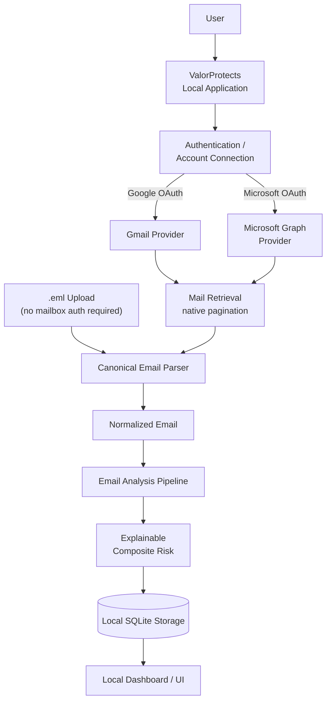

Two ways in — an authenticated mailbox or a dropped-in `.eml` file —
converge on the same parser, and everything downstream of that point
(normalization, analysis, risk scoring, storage, UI) runs locally.

## Current MVP vs target architecture

| Aspect | Current MVP | Target architecture |
|---|---|---|
| Where heavy analysis runs | Locally, on the user's machine | Unchanged — stays local-first |
| Result storage | Local SQLite | Local SQLite |
| Remote server | None — the FastAPI app itself runs on `localhost` | A minimal service limited to auth/session handoff |
| Email content | Never leaves the local machine for analysis | Never centrally uploaded for analysis |
| Mailbox access | Gmail / Microsoft OAuth (needs internet) | Unchanged |
| `.eml` upload | Zero-config, no mailbox auth | Unchanged |
| Threat intel lookups | Local heuristics + optional network lookups | Unchanged |

## Detailed email analysis flow

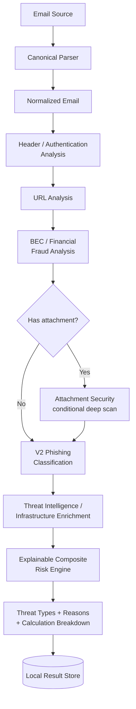

Attachment security only runs when an email actually has attachments
— it's additive, not a stage every email pays for. Threat
intelligence is an extra evidence source, not a verdict on its own.
Deterministic, high-confidence signals (like a YARA match) can impose
a risk floor that a low ML probability cannot dilute away. V2 is the
production classifier at this stage; the final score is explainable
rather than a single opaque probability.

## Local-first data boundary

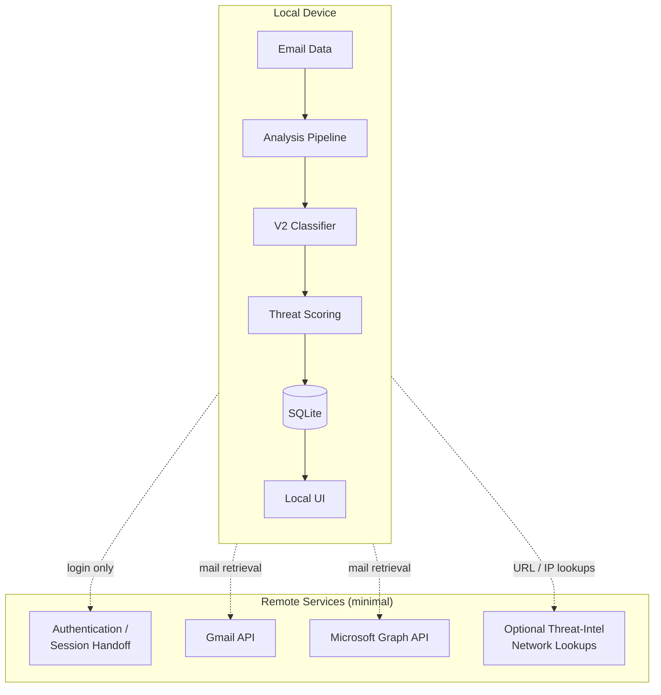

Everything inside the local-device boundary — the raw email, the
analysis pipeline, the classifier, the risk scoring, storage, and the
UI — stays on the user's machine. Full email content is never
centrally stored for analysis; the only things that cross the
boundary are OAuth/session handoff, mailbox retrieval calls to the
provider APIs, and optional reputation lookups for a URL or IP.

## Production V2 classification path

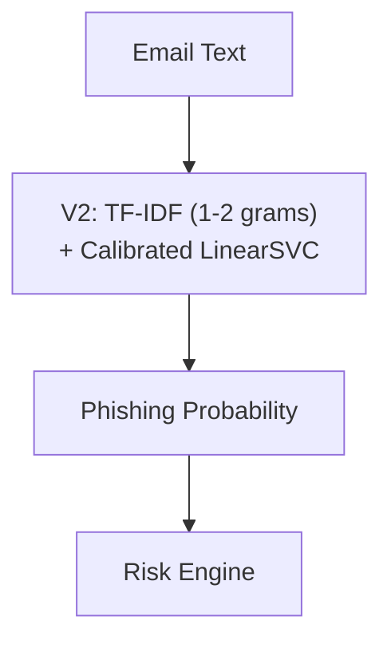

**V2 is the production model.** V2.1 was evaluated as an experimental
hard-mining variant and was **not promoted** — it is evaluation-only
and does not run in production.

## Risk engine

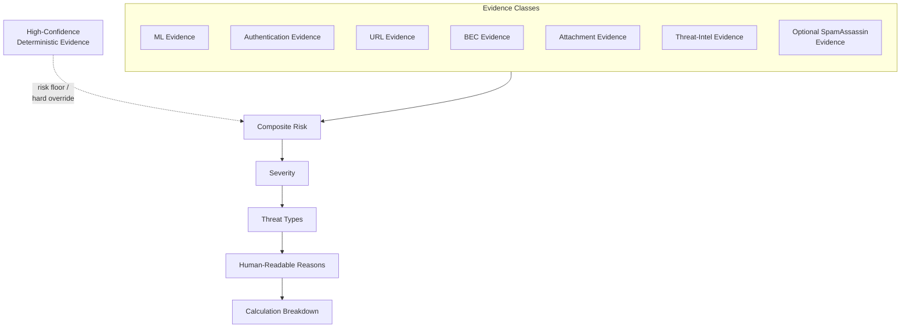

The composite score is explainable: it's a combination of independent
evidence classes, not one model's opinion. High-confidence
deterministic evidence (for example, a YARA match) can impose a risk
floor or hard override that **cannot be neutralized by a benign ML
probability** — this is a deliberate, documented safety policy, not
an accident of scoring.

## Attachment security

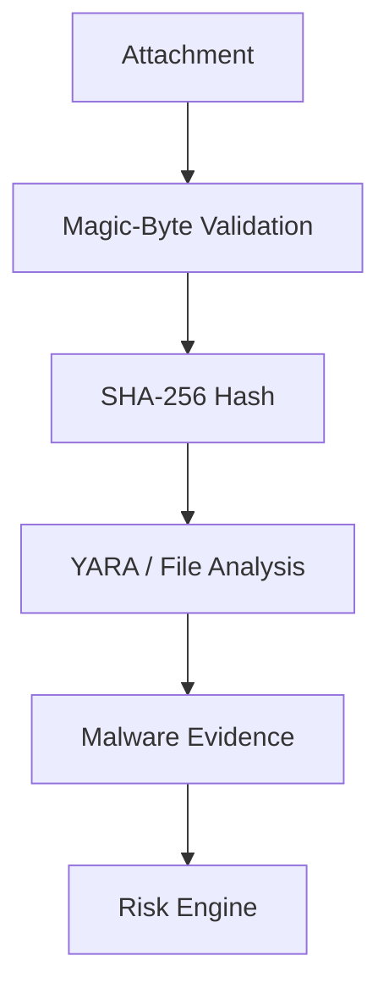

Runs conditionally, only when an email has attachments — cheap
metadata and byte-level checks first, YARA only if needed.

## Threat intelligence

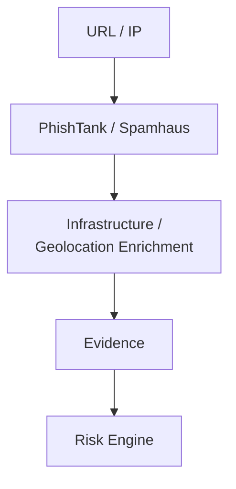

Threat intelligence is one evidence source among several feeding the
risk engine — it's visually and functionally subordinate to the main
email-analysis flow, not a gate in front of it.

## Optional SpamAssassin

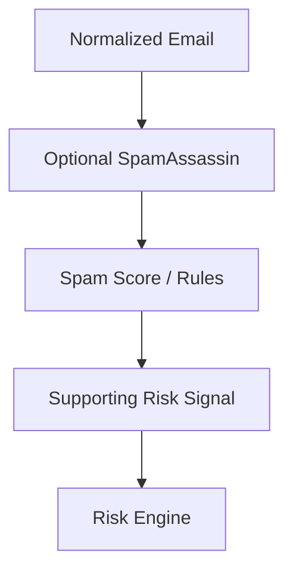

SpamAssassin is already integrated as an **optional, supporting**
evidence stage — not the main classifier, not a phishing verdict on
its own, and it does not create deterministic high-risk overrides.

## Indic / NLLB prototype path

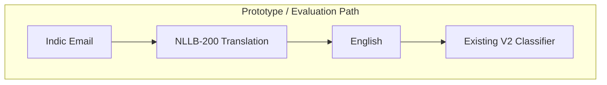

This path is isolated as a **prototype / evaluation path**, compared
against V2's direct multilingual handling — it is not the core
production architecture, and the multilingual implementation itself
is unchanged here.

## Future voluntary threat reporting

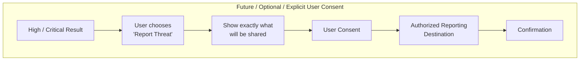

Possible destinations described in the documentation include a
cybercrime department, a relevant ministry, an SIH host/organizer, or
another authorized organization. Reporting is **never automatic** —
it only happens if the user explicitly opts in after seeing exactly
what would be shared.

## Storage and privacy model

- Analysis results are stored **locally**, in SQLite, on the user's
  machine — not centrally.
- OAuth tokens stay server-side (i.e., inside the local process) and
  are never exposed to frontend JavaScript; the browser only ever
  holds a signed, random session id.
- Cached/scanned data is scoped to `(session_id, provider,
  account_id, message_id)` — there is no global "current mailbox."
- Threat intelligence lookups (PhishTank, Spamhaus) are bundled
  locally where possible; optional network lookups are limited to
  URL/IP reputation and infrastructure enrichment, not email content.
- Attachments are inspected — magic bytes, hash, YARA — without ever
  being executed.

## Deployment architecture

Today, ValorProtects is deployed by running the FastAPI app directly
on the user's machine (`uvicorn backend.app.main:app --port 8000`)
and opening `http://localhost:8000` — there is no separate hosted
backend. The target architecture keeps that shape and adds, at most,
a minimal remote service scoped to authentication/session handoff;
it is not intended to take on analysis workload.

## Architecture invariants

- V2 is the production phishing model.
- V2.1 was evaluated but not promoted to production.
- SpamAssassin is optional and already integrated — not "in
  development."
- NLLB-based translation is a prototype/evaluation path, not the core
  production architecture.
- Result storage is local SQLite.
- The architecture is local-first; heavy analysis runs on-device.
- `.eml` upload requires no mailbox OAuth.
- Gmail and Microsoft mailbox access require their APIs and internet
  connectivity.
- Any future remote infrastructure is intentionally minimal (auth/
  session handoff only).
- Voluntary threat reporting is a future, consent-based feature —
  never automatic.

---

## Provider abstraction

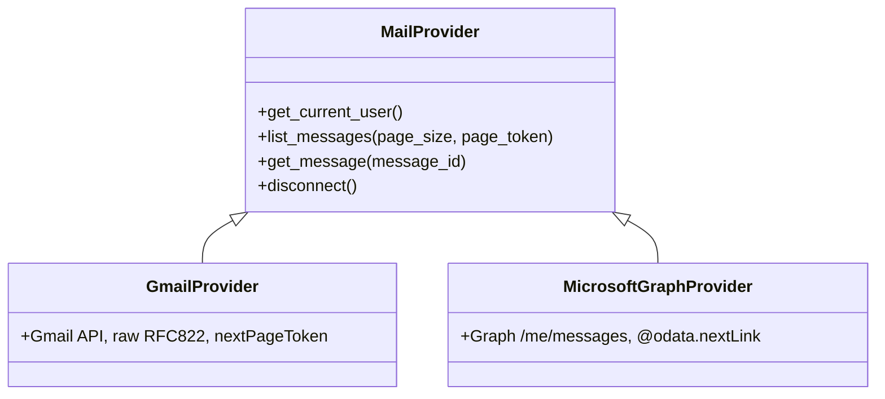

Nothing above the provider layer branches on which provider produced
a message. Both `get_message()` implementations return the same
`NormalizedEmail` shape (`backend/app/schemas/email_message.py`).

## Session / OAuth flow (Google shown; Microsoft is structurally identical)

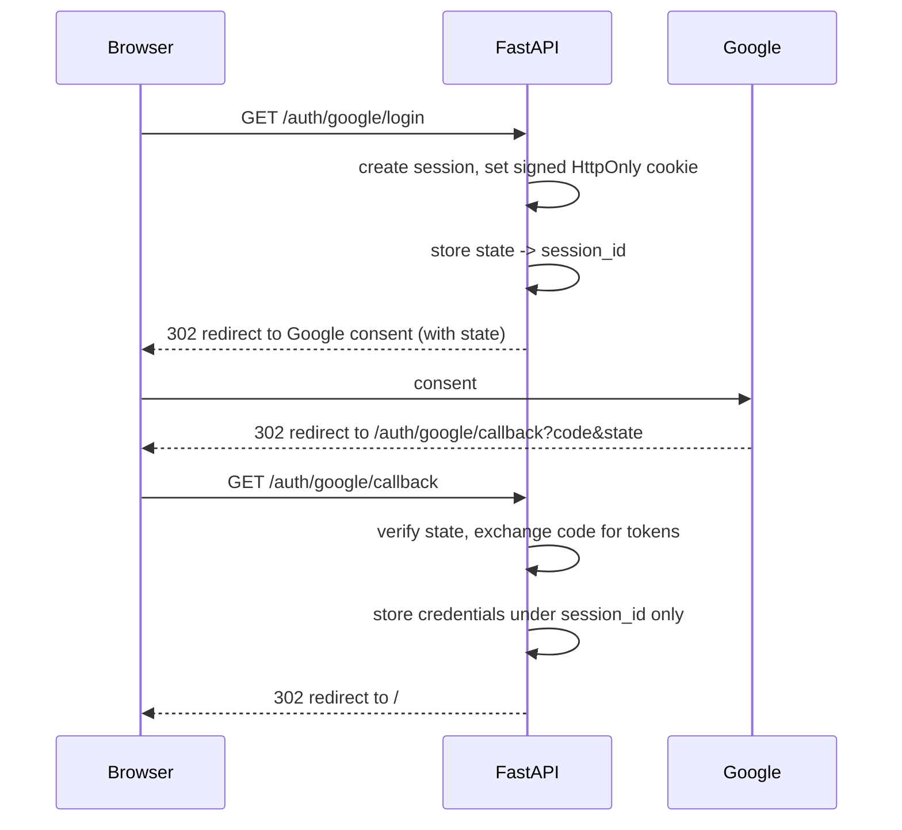

The cookie only ever carries a signed random session id. Tokens never
reach the browser (no localStorage, no URL params). This exchange
happens inside the local FastAPI process — there is no separate
hosted auth server today.

## User isolation

Every cached analysis result and every scan is keyed by
`(session_id, provider, account_id, message_id)`. There is no global
`CURRENT_USER` / `CURRENT_MAILBOX` anywhere in the codebase. See
`backend/app/services/store.py` and `backend/app/auth/session.py`.

## Batch scan concurrency

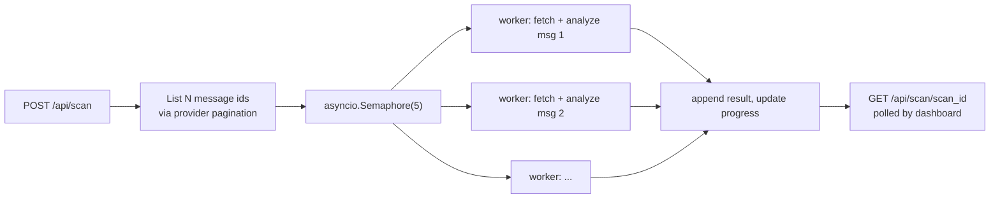

A single message's failure (parse error, provider timeout) is caught
per-worker and recorded as `status: analysis_failed` without aborting
the other workers — verified in integration testing (see
MERGE_LOG.md).