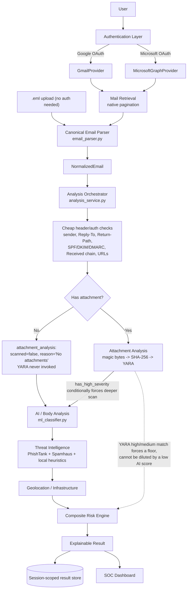
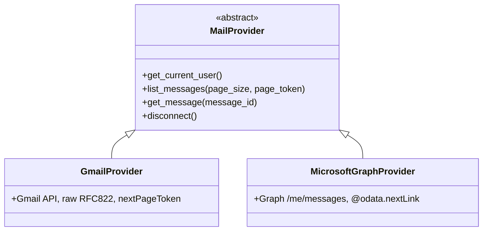
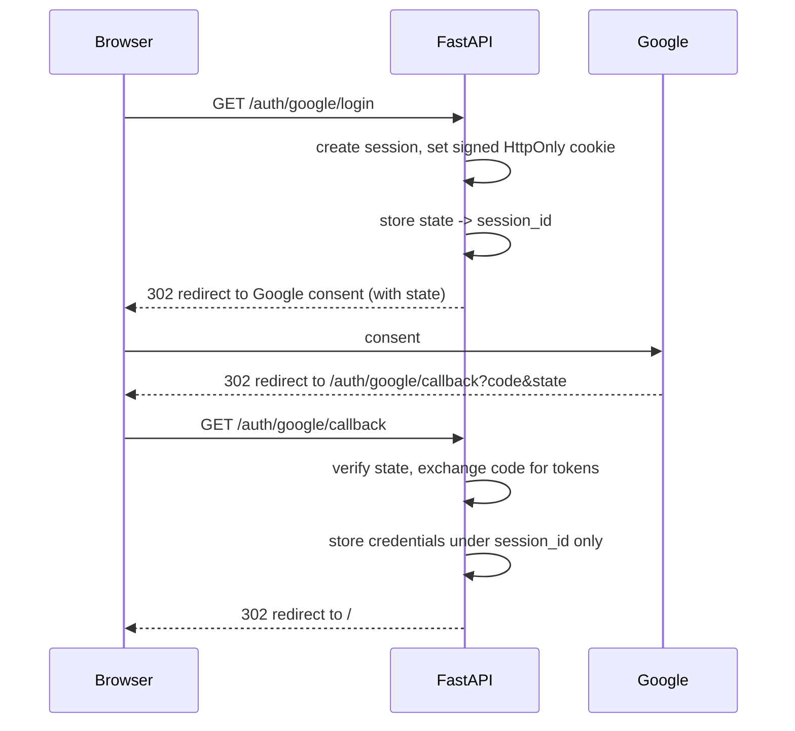
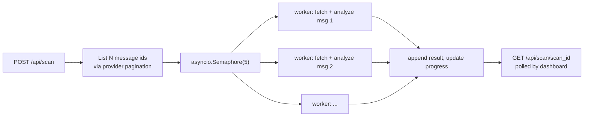

# ARCHITECTURE.md

## High-level flow

**Why attachment-first/conditional**: attachment metadata and bytes
are available immediately after parsing, before any network call or
model inference - the cheapest possible signal. When an email has no
attachments, `attachment_analysis.py` returns immediately
(`scanned: false, reason: "No attachments"`) without touching the
YARA module or the magic-byte detector at all, so most emails (which
have no attachments) never pay that cost. When an email does have
attachments, a high-severity finding (executable/script extension,
macro-enabled document, disguised double extension, extension/magic-
byte mismatch, or a YARA match) conditionally forces the deeper
rule-based text scan in the AI stage even when the ML phishing
probability alone is low - additive only, it never skips a stage for
any email. A YARA high/medium-severity match additionally forces an
explicit risk floor (>= HIGH) in the composite risk engine, so a
convincingly bland email body cannot dilute away real attachment
evidence - this is a deliberate, documented policy, not "YARA
matched -> automatic 100".

**Functional names vs internal labels**: "M1"-"M6" were this
project's internal team-task labels only. The functional names are:
Email Parser, Header & Authentication Analysis, AI Threat
Classification, Threat Intelligence Engine, Attachment Security
Engine, YARA Scanner, URL/Domain Analysis, IP Geolocation &
Infrastructure Analysis, Risk Engine, Mail Provider Layer, OAuth
Authentication, SOC Dashboard. The internal Python module names
(`m1_header_analyzer.py`, variables named `m1_result`, etc.) are
implementation detail and were not renamed this pass to avoid
touching working, tested code; the *API response* attachment/security
fields already use functional shapes (`attachment_analysis`,
`attachments[].yara`, `attachments[].detected_type`, etc.) rather than
"M1"/"M2" labels. Fully renaming the remaining internal `m1`/`m2`/`m3`/`m4`
dict keys in the API response is tracked as a known limitation, not
done in this pass (see PROJECT_CONTEXT.md).

## Provider abstraction

Nothing above the provider layer branches on which provider produced
a message. Both `get_message()` implementations return the same
`NormalizedEmail` shape (`backend/app/schemas/email_message.py`).

## Session / OAuth flow (Google shown; Microsoft is structurally identical)

The cookie only ever carries a signed random session id. Tokens never
reach the browser (no localStorage, no URL params).

## User isolation

Every cached analysis result and every scan is keyed by
`(session_id, provider, account_id, message_id)`. There is no global
`CURRENT_USER` / `CURRENT_MAILBOX` anywhere in the codebase. See
`backend/app/services/store.py` and `backend/app/auth/session.py`.

## Batch scan concurrency

A single message's failure (parse error, provider timeout) is caught
per-worker and recorded as `status: analysis_failed` without aborting
the other workers - verified in integration testing (see
MERGE_LOG.md).
