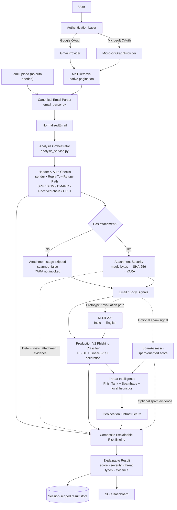
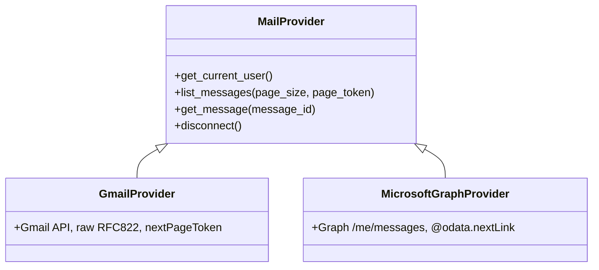
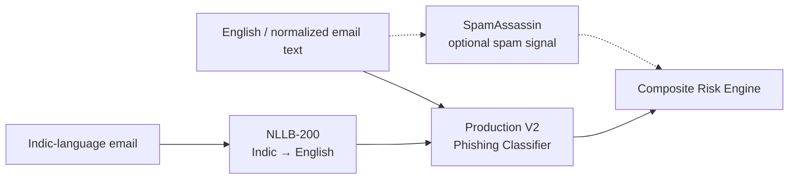
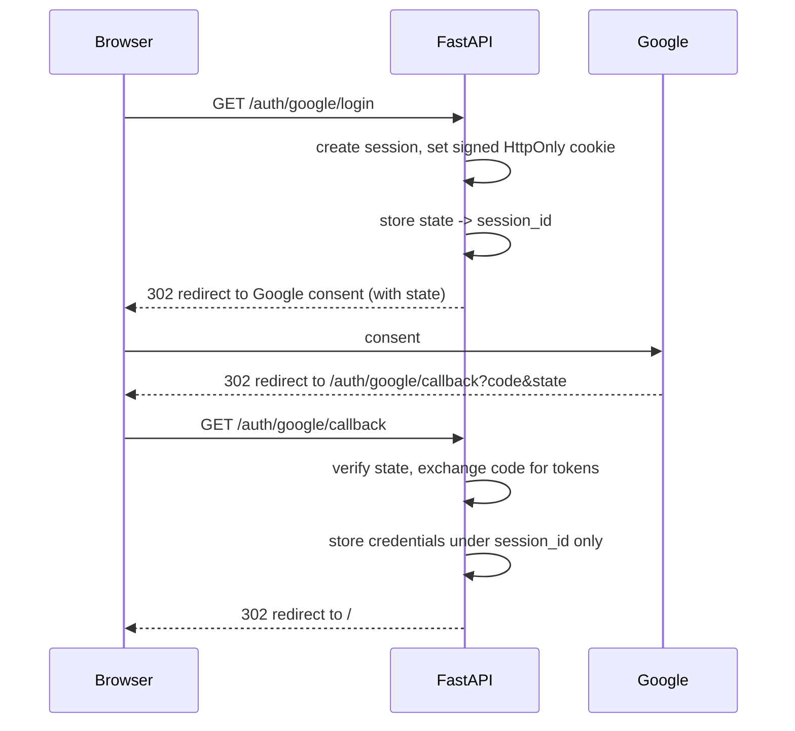
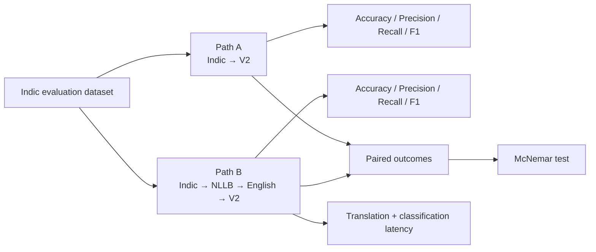
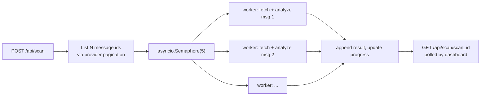

# ARCHITECTURE.md

## High-level flow



### Detailed end-to-end flowchart

The diagram below shows the full analysis lifecycle, including provider normalization, cheap deterministic checks, the conditional attachment branch, production V2, the isolated NLLB multilingual path, the optional SpamAssassin signal, enrichment, risk floors/overrides, and the final dashboard result.

```mermaid
flowchart TD
    %% =========================
    %% INPUT + PROVIDERS
    %% =========================
    subgraph INPUT[1. INPUT & MAILBOX ACCESS]
        USER[User / SOC Analyst]
        EML[.eml upload]
        LOGIN[OAuth login]
        GMAIL[Gmail Provider]
        MS[Microsoft Graph Provider]
        PAGE[Provider pagination\npage_size + page_token]
        FETCH[Fetch raw message]

        USER --> LOGIN
        USER --> EML
        LOGIN --> GMAIL
        LOGIN --> MS
        GMAIL --> PAGE
        MS --> PAGE
        PAGE --> FETCH
        EML --> FETCH
    end

    %% =========================
    %% PARSING + NORMALIZATION
    %% =========================
    subgraph NORMALIZE[2. CANONICAL PARSING & NORMALIZATION]
        PARSE[Canonical Email Parser\nemail_parser.py]
        MIME[MIME / RFC822 parsing]
        HEADERS[Extract headers]
        BODYRAW[Extract plain + HTML body]
        LINKS[Extract actual href / src / action URLs]
        ATT_META[Extract attachment metadata + bytes]
        NORM[NormalizedEmail]

        FETCH --> PARSE
        PARSE --> MIME
        PARSE --> HEADERS
        PARSE --> BODYRAW
        PARSE --> LINKS
        PARSE --> ATT_META
        MIME --> NORM
        HEADERS --> NORM
        BODYRAW --> NORM
        LINKS --> NORM
        ATT_META --> NORM
    end

    %% =========================
    %% ORCHESTRATION + CHEAP SIGNALS
    %% =========================
    subgraph FAST[3. ORCHESTRATION & FAST SIGNALS]
        ORCH[Analysis Orchestrator\nanalysis_service.py]
        AUTHCHECK[Header & Authentication Analysis]
        SENDER[Sender / From analysis]
        REPLY[Reply-To comparison]
        RETURN[Return-Path comparison]
        AUTHRES[SPF / DKIM / DMARC]
        RECEIVED[Received-chain inspection]
        URLCHECK[URL / domain heuristics]
        BEC[Rule-based BEC signals]

        NORM --> ORCH
        ORCH --> AUTHCHECK
        AUTHCHECK --> SENDER
        AUTHCHECK --> REPLY
        AUTHCHECK --> RETURN
        AUTHCHECK --> AUTHRES
        AUTHCHECK --> RECEIVED
        AUTHCHECK --> URLCHECK
        AUTHCHECK --> BEC
    end

    %% =========================
    %% ATTACHMENT BRANCH
    %% =========================
    subgraph ATTACH[4. CONDITIONAL ATTACHMENT SECURITY]
        HASATT{Attachment present?}
        SKIP[No attachment\nattachment_analysis.scanned=false\nYARA not invoked]
        TYPE[File type / magic-byte detection]
        HASH[SHA-256]
        YARA[YARA scan]
        ATTFLAGS[Attachment findings\nexecutable / script / macro / mismatch / disguise]
        YSEV{YARA severity /\nattachment severity?}
        DEEP[Force deeper rule-based text scan]

        NORM --> HASATT
        HASATT -->|No| SKIP
        HASATT -->|Yes| TYPE
        TYPE --> HASH
        HASH --> YARA
        TYPE --> ATTFLAGS
        YARA --> ATTFLAGS
        ATTFLAGS --> YSEV
        YSEV -->|High severity| DEEP
        YSEV -->|Medium severity| DEEP
    end

    %% =========================
    %% CONTENT + MODEL LAYER
    %% =========================
    subgraph CLASSIFY[5. CONTENT & CLASSIFICATION]
        CONTENT[Normalized email text + cheap signals]
        RULES[Rule-based threat scan]
        V2[Production V2 Phishing Classifier\nTF-IDF + LinearSVC + calibration]
        V2OUT[V2 phishing probability / class]

        SKIP --> CONTENT
        ATTFLAGS --> CONTENT
        BODYRAW --> CONTENT
        LINKS --> CONTENT
        AUTHCHECK --> CONTENT
        BEC --> CONTENT
        DEEP --> RULES
        CONTENT --> RULES
        RULES --> V2
        CONTENT --> V2
        V2 --> V2OUT
    end

    %% =========================
    %% MULTILINGUAL PATH
    %% =========================
    subgraph MULTI[6. MULTILINGUAL NLLB PATH — PROTOTYPE / EVALUATION]
        LANG{Indic-language input?}
        NLLB[NLLB-200\nIndic → English]
        ENTXT[Translated English text]
        SAMEV2[Same production V2 classifier]
        EVALA[Evaluation Path A\nIndic → V2]
        EVALB[Evaluation Path B\nIndic → NLLB → V2]

        CONTENT --> LANG
        LANG -->|Yes / evaluation run| NLLB
        NLLB --> ENTXT
        ENTXT --> SAMEV2
        SAMEV2 --> V2OUT
        CONTENT --> EVALA
        ENTXT --> EVALB
    end

    %% =========================
    %% SPAMASSASSIN PATH
    %% =========================
    subgraph SPAM[7. SPAMASSASSIN — OPTIONAL COMPLEMENTARY SIGNAL]
        SA[SpamAssassin]
        SASCORE[Spam-oriented score / evidence]
        SAINFO[Spam evidence kept distinct\nfrom phishing / malware / BEC]

        CONTENT -.->|When enabled| SA
        SA --> SASCORE
        SASCORE --> SAINFO
    end

    %% =========================
    %% THREAT INTEL + INFRA
    %% =========================
    subgraph ENRICH[8. THREAT INTELLIGENCE & INFRASTRUCTURE]
        TI[Threat Intelligence Layer]
        PT[PhishTank checks]
        SH[Spamhaus checks]
        LOCAL[Local URL / domain heuristics]
        DEST[Redirect / destination analysis]
        LOOK[Brand lookalike / homoglyph analysis]
        GEO[IP Geolocation]
        INFRA[Infrastructure context]

        V2OUT --> TI
        URLCHECK --> TI
        TI --> PT
        TI --> SH
        TI --> LOCAL
        LOCAL --> DEST
        LOCAL --> LOOK
        TI --> GEO
        GEO --> INFRA
        SASCORE -.->|Optional evidence| TI
    end

    %% =========================
    %% COMPOSITE RISK ENGINE
    %% =========================
    subgraph RISK[9. COMPOSITE EXPLAINABLE RISK ENGINE]
        SIGNALS[Aggregate evidence]
        BASE[Base weighted score]
        RULECAP[Rule-based contribution cap]
        TLCAP[Threat-intel contribution caps]
        LOCALCAP[Local heuristic caps]
        ATTCAP[Attachment contribution cap]
        FLOORS[Severity floors]
        OVERRIDE[High-confidence overrides]
        SCORE[Final risk score + severity]
        TYPES[Threat types]
        REASONS[Explainable evidence + calculation]

        AUTHCHECK --> SIGNALS
        BEC --> SIGNALS
        V2OUT --> SIGNALS
        ATTFLAGS --> SIGNALS
        YARA --> SIGNALS
        PT --> SIGNALS
        SH --> SIGNALS
        LOCAL --> SIGNALS
        INFRA --> SIGNALS
        SAINFO --> SIGNALS

        SIGNALS --> BASE
        BASE --> RULECAP
        RULECAP --> TLCAP
        TLCAP --> LOCALCAP
        LOCALCAP --> ATTCAP
        ATTCAP --> FLOORS
        FLOORS --> OVERRIDE
        OVERRIDE --> SCORE
        SCORE --> TYPES
        SCORE --> REASONS
    end

    %% =========================
    %% OUTPUT + STORAGE
    %% =========================
    subgraph OUTPUT[10. RESULT, STORAGE & SOC DASHBOARD]
        RESULT[Explainable Analysis Result\nscore • severity • threat types • evidence]
        STORE[(Session-scoped result store)]
        SCAN[(Scan progress / scan results)]
        API[FastAPI JSON API]
        DASH[SOC Dashboard]
        ANALYST[Analyst review]

        SCORE --> RESULT
        TYPES --> RESULT
        REASONS --> RESULT
        RESULT --> STORE
        RESULT --> API
        API --> DASH
        STORE --> DASH
        SCAN --> DASH
        DASH --> ANALYST
    end

    %% =========================
    %% SCAN LOOP
    %% =========================
    subgraph BATCH[11. BATCH SCAN CONTROL FLOW]
        STARTSCAN[POST /api/scan]
        LIMIT[Validate message-id limit]
        SEM[asyncio.Semaphore(5)]
        WORKERS[Concurrent workers\nfetch → analyze → append]
        PROGRESS[Progress updates]
        POLL[GET /api/scan/{scan_id}]
        FAIL[Per-message failure isolation\nstatus=analysis_failed]

        USER --> STARTSCAN
        STARTSCAN --> LIMIT
        LIMIT --> SEM
        SEM --> WORKERS
        WORKERS --> PROGRESS
        WORKERS --> FAIL
        PROGRESS --> POLL
        POLL --> DASH
    end
```

### How to read the flowchart

**1. Input and providers.** Gmail and Microsoft Graph are hidden behind the same provider abstraction. `.eml` upload enters the same canonical parsing pipeline without OAuth. Provider pagination happens before message analysis.

**2. Canonical normalization.** Raw RFC822/MIME content is converted into one `NormalizedEmail` representation. Headers, meaningful body text, actual embedded/link URLs, and attachment bytes become structured inputs for later stages.

**3. Cheap deterministic checks happen early.** Sender, Reply-To, Return-Path, SPF/DKIM/DMARC, Received-chain, URL, and BEC checks produce evidence before the heavier model/enrichment stages.

**4. The attachment branch is conditional.** No attachment means the attachment engine exits immediately and YARA is not invoked. With an attachment, magic-byte/type inspection and SHA-256 happen before YARA. High-severity attachment evidence can force deeper rule-based content analysis.

**5. V2 is the production phishing path.** The final production classifier is the V2 TF-IDF + LinearSVC + calibration pipeline. Its output is one evidence source inside the composite risk engine, not the sole decision-maker.

**6. NLLB is a language-processing branch, not a new verdict engine.** Indic text can pass through NLLB-200 into English and then through the same production V2 classifier. The evaluation harness also keeps direct Indic classification and translated classification as separate paths so their metrics can be compared fairly.

**7. SpamAssassin is complementary.** When enabled, SpamAssassin contributes spam-oriented evidence to the risk layer. It is deliberately separate from phishing, malware, and BEC classifications.

**8. Threat intelligence and infrastructure add external context.** URL/domain evidence can be checked against PhishTank, Spamhaus, and local heuristics, then enriched with IP/geolocation/infrastructure context.

**9. Risk scoring is evidence-aware.** Contributions are aggregated, bounded by configured caps, then severity floors and high-confidence overrides are applied. This is where deterministic malware, confirmed intelligence, and serious BEC/authentication evidence can prevent a low ML score from erasing stronger evidence.

**10. The output is explainable.** The result contains the final score/severity, threat types, evidence, and risk calculation, then flows through the FastAPI API to the session-scoped store and SOC dashboard.

**11. Batch scanning is controlled independently.** `/api/scan` validates the requested message set, uses bounded concurrency (`Semaphore(5)`), isolates per-message failures, and exposes progress for the dashboard to poll.

## Production analysis path

The primary phishing-analysis path is:

`NormalizedEmail → Header/Auth Checks → Conditional Attachment Security → Production V2 → Threat Intelligence → Geolocation/Infrastructure → Composite Risk Engine → Explainable Result`

The production phishing model is **V2**. The V2 artifacts live under `backend/app/models/v2/` and are explicitly loaded by the classifier. The older flat phishing artifacts are not the production model.

### Multilingual NLLB path

For the multilingual prototype/evaluation flow:

`Indic Email → NLLB-200 Translation → English Text → Production V2 → Risk Engine`

NLLB is an **evaluation/prototype path**, not the production default. It lets the project compare direct classification of Indic text against translation to English followed by the same V2 classifier. The multilingual evaluation is therefore connected to the production V2 classifier without replacing it.

### SpamAssassin path

SpamAssassin is represented as a **complementary spam signal**:

`Email / Body → SpamAssassin → Spam Evidence → Composite Risk Engine`

Its role is spam-oriented scoring and supporting evidence. It should remain separate from phishing, malware, and BEC evidence rather than being treated as a phishing verdict by itself.

### Evidence priority in the risk layer

The composite risk engine combines several evidence classes:

1. Deterministic security evidence — attachment type/magic bytes, YARA, confirmed threat-intelligence matches.
2. Authentication evidence — SPF/DKIM/DMARC, Reply-To, Return-Path, sender relationships.
3. Content/model evidence — production V2 phishing probability and rule-based signals.
4. Threat-intelligence and infrastructure evidence — PhishTank, Spamhaus, URL/domain heuristics, IP/geolocation context.
5. Optional spam evidence — SpamAssassin when enabled.
6. Multilingual processing — NLLB changes the language-processing path; translation itself is not a threat verdict.

High-confidence deterministic evidence can impose configured severity floors or hard overrides, so a benign-looking ML score cannot erase strong malware, confirmed-intel, or serious BEC/authentication evidence.

### Attachment-first / conditional security

Attachment metadata and bytes are available immediately after parsing, before any network call or model inference. When an email has no attachments, `attachment_analysis.py` returns immediately (`scanned: false, reason: "No attachments"`) without touching the YARA module or magic-byte detector.

When an email does have attachments, high-severity findings such as executable/script extensions, macro-enabled documents, disguised double extensions, extension/magic-byte mismatch, or a YARA match conditionally force deeper rule-based text analysis even when ML phishing probability is low. This is additive: it never skips an analysis stage.

A YARA high/medium-severity match also forces an explicit risk floor in the composite risk engine, so a convincingly bland email body cannot dilute strong attachment evidence.

### Functional names vs internal labels

"M1"-"M6" were this project's internal team-task labels only. The functional names are:

- Email Parser
- Header & Authentication Analysis
- AI Threat Classification
- Threat Intelligence Engine
- Attachment Security Engine
- YARA Scanner
- URL/Domain Analysis
- IP Geolocation & Infrastructure Analysis
- Risk Engine
- Mail Provider Layer
- OAuth Authentication
- SOC Dashboard
- Multilingual Translation / Evaluation
- Spam Analysis

The internal Python module names (`m1_header_analyzer.py`, variables named `m1_result`, etc.) are implementation details and were not renamed merely to change documentation. The API response uses functional shapes such as `attachment_analysis`, `attachments[].yara`, and `attachments[].detected_type`.

## Provider abstraction



Nothing above the provider layer branches on which provider produced
a message. Both `get_message()` implementations return the same
`NormalizedEmail` shape (`backend/app/schemas/email_message.py`).

## ML, multilingual, and spam-analysis components



| Component | Role | Status |
|---|---|---|
| **V2 phishing classifier** | Primary English phishing classification | **Production path** |
| **NLLB-200** | Indic-language translation for multilingual evaluation/prototyping | **Prototype / evaluation** |
| **SpamAssassin** | Complementary spam-oriented evidence | **Optional / planned integration** |

NLLB and SpamAssassin are shown as connected components without implying that either replaces the production V2 phishing detector.

## Session / OAuth flow (Google shown; Microsoft is structurally identical)



The cookie only ever carries a signed random session id. Tokens never
reach the browser (no localStorage, no URL params).

## User isolation

Every cached analysis result and every scan is keyed by
`(session_id, provider, account_id, message_id)`. There is no global
`CURRENT_USER` / `CURRENT_MAILBOX` anywhere in the codebase. See
`backend/app/services/store.py` and `backend/app/auth/session.py`.

## Multilingual evaluation architecture



The evaluation harness keeps classifier and translation failures explicit, reports pooled and per-language metrics, tracks paired disagreements, and measures the additional latency of the translated path. The current Indic evaluation dataset is synthetic and is intended for comparative evaluation rather than as a production-accuracy claim.

## Batch scan concurrency



A single message's failure (parse error, provider timeout) is caught
per-worker and recorded as `status: analysis_failed` without aborting
the other workers - verified in integration testing (see
MERGE_LOG.md).
