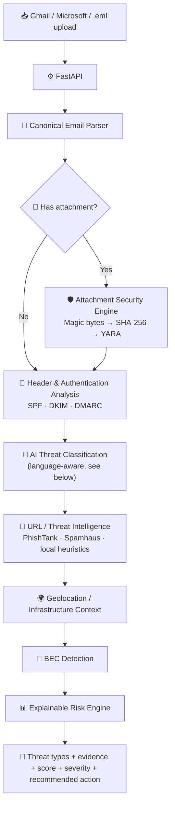
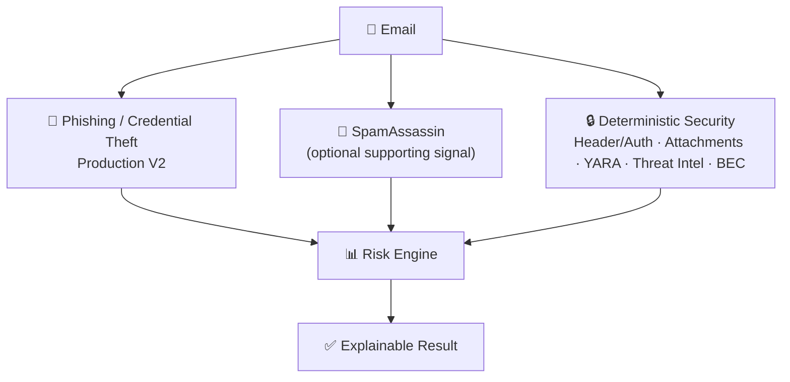
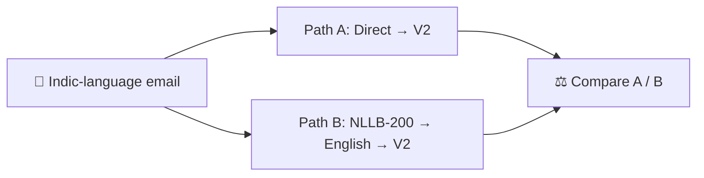

<div align="center">

# 🛡️ ValorProtects

### AI-Powered Email Threat Detection, Geolocation & Forensic Intelligence

Provider-independent email security research platform combining machine learning, authentication analysis, threat intelligence, and explainable risk scoring — built on FastAPI with an analyst-facing dashboard.

<p>
  
  
  
  
</p>

[Architecture](ARCHITECTURE.md) · [Project Context](PROJECT_CONTEXT.md) · [Quick Start](#-quick-start) · [Roadmap](#-roadmap)

</div>

---

## 📋 Table of Contents

- [The Problem](#-the-problem)
- [How ValorProtects Works](#-how-valorprotects-works)
- [AI Detection Architecture](#-ai-detection-architecture)
- [Multilingual / Indic Email Support](#-multilingual--indic-email-support)
- [Production ML Model](#-production-ml-model)
- [Security & Privacy Design](#-security--privacy-design)
- [Mailbox Support](#-mailbox-support)
- [Quick Start](#-quick-start)
- [Testing](#-testing)
- [Project Structure](#-project-structure)
- [Known Limitations](#-known-limitations)
- [Future Voluntary Threat Reporting](#-future-voluntary-threat-reporting)
- [Roadmap](#-roadmap)
- [Documentation](#-documentation)
- [Project Status](#-project-status)

---

## 🎯 The Problem

Most email security tools make a decision based on a single weak signal — one phishing probability score, one URL reputation check, or one authentication result. Each of these, on its own, is easy to spoof or wrong often enough to matter:

- A phishing model can be fooled by a short, sparse, mostly-legitimate message.
- SPF/DKIM/DMARC can pass while the *content* is still malicious.
- A URL check can miss a brand-new or freshly-registered malicious domain.
- None of these alone tell you *why* a message is dangerous.

ValorProtects treats each of these as **independent evidence**, not a final verdict. Header/authentication analysis, attachment inspection, AI text classification, URL and threat-intel lookups, geolocation/infrastructure context, and BEC-specific heuristics are combined by an **explainable risk engine**, so the final score always comes with the evidence behind it.

Security principle: **email is treated as hostile evidence**. Attachments are inspected — magic bytes, hashes, YARA — without being executed, and message-originated remote resources are never executed as part of analysis.

---

## 🧭 How ValorProtects Works



A high-severity attachment finding (executable extension, macro-enabled document, disguised double extension, magic-byte mismatch, or a YARA match) conditionally forces a deeper rule-based scan at the AI stage — even when the ML phishing probability alone is low. A YARA high/medium match also forces a risk floor in the composite engine, so a blandly-worded email body can't dilute away real attachment evidence.

---

## 🧠 AI Detection Architecture

Detection is split into independent detectors that all feed the same risk engine, rather than one model trying to catch everything:



The design intentionally keeps **phishing ≠ spam ≠ malware ≠ BEC** as separate signals rather than forcing every threat type through one classifier. SpamAssassin is implemented and optional — a supporting spam signal, not the primary phishing classifier — and is integrated into the risk calculation as an optional supporting contribution rather than a phishing verdict by itself.

---

## 🌏 Multilingual / Indic Email Support

Earlier versions of the phishing classifier only understood English, so non-English email had no reliable coverage. The current pipeline handles Indic-language email two ways:

- **Path A — Direct:** the production V2 model has been retrained on a multilingual synthetic dataset covering 11 Indic languages, so it can classify Indic-language email directly, without translation.
- **Path B — Translate, then classify:** the email is translated to English with **NLLB-200 (distilled, 600M)** and then run through the same V2 model, so the result can be compared against Path A. Path B is a prototype/evaluation path used for benchmarking and remains isolated from the production V2 decision path, which relies on Path A.



**Device-adaptive execution:** running NLLB on a low-resource device can be slow enough to block analysis, so on those devices NLLB is disabled by default and the email goes straight through Path A. Devices with enough headroom run both paths and compare them.

### Evaluation dataset

`datasets/evaluation/indic/indic_eval.csv` — 1,100 samples, 100 per language, 11 languages (605 legitimate / 495 phishing), synthetic/template-derived and **not yet native-speaker reviewed**:

```
hin_Deva  tel_Telu  tam_Taml  kan_Knda  mal_Mlym
mar_Deva  ben_Beng  guj_Gujr  ory_Orya  pan_Guru
urd_Arab
```

### Current benchmark result

| Metric | Path A: Indic → V2 | Path B: Indic → NLLB → English → V2 |
|---|---|---|
| Accuracy | 79.73% | 85.00% |
| Precision | 72.52% | 83.54% |
| Recall | 88.48% | 83.03% |
| F1 | 79.71% | 83.28% |

- **Accuracy** — how many predictions were correct overall.
- **Precision** — when the system says "phishing," how often is it actually phishing?
- **Recall** — of all the actual phishing emails, how many did it catch?
- **F1** — a combined measure of precision and recall.

These numbers are **benchmark-specific, synthetic-data results**, not production accuracy claims.

<details>
<summary>Why "paired" evaluation matters</summary>

The comparison isn't 100 different emails through Path A and a different 100 through Path B — it's the *same* email through both paths (`Email #123 → A` and `Email #123 → B`), so A-vs-B deltas are computed only over samples where both paths produced a prediction. The evaluator keeps failed operations separate from legitimate predictions, reports pooled and macro-averaged metrics, runs McNemar's test where applicable, and records source/translated text for inspection.

Run it yourself:
```bash
.\.venv\Scripts\python.exe scripts\validate_indic_eval_dataset.py
.\.venv\Scripts\python.exe scripts\evaluate_indic_nllb.py --lang hin_Deva --max-per-lang 3
.\.venv\Scripts\python.exe scripts\evaluate_indic_nllb.py
```
Results are written to `datasets/evaluation/indic/results/`.
</details>

---

## 🧠 Production ML Model

The production phishing classifier is **V2** (`backend/app/models/v2/`): TF-IDF text features (1–2 grams, 50,000 max features) with a calibrated linear classifier (LinearSVC + CalibratedClassifierCV). On its test set, V2 reaches **98.95% accuracy** (98.79% precision, 98.93% recall, 98.86% F1, 99.92% ROC-AUC) — a separate figure from the Indic multilingual benchmark above, which uses a smaller synthetic dataset built specifically to compare the direct vs. translate-then-classify paths.

**V2.1** was evaluated as an experimental hard-mining variant and was **not promoted** to production.

The application does not retrain or silently replace the production model during execution.

---

## 🔐 Security & Privacy Design

- **Local-first:** ValorProtects is local-first — heavy email analysis (parsing, classification, risk scoring) runs on the user's own computer, and email content is processed locally. The current FastAPI/browser interface is the MVP implementation, not the final architectural identity of the product; a future remote service would be minimal and primarily support authentication/login/session handoff. Gmail/Microsoft mailbox access still requires internet/API access.
- Analysis results, scan cache, and account metadata are stored **locally in SQLite** — the local-first design reduces unnecessary central storage of email content. Privacy is a core architectural principle.
- OAuth tokens stay server-side; they are never exposed to frontend JavaScript.
- OAuth callback `state` is verified for CSRF protection.
- Cached/scanned mailbox data is scoped to the authenticated session, provider, account, and message — there's no global "current mailbox."
- Threat intelligence (PhishTank, Spamhaus DROP) is bundled locally; the core pipeline needs no end-user API keys.
- Attachments are analyzed — magic bytes, hash, YARA — without ever being executed.
- Local secrets belong in `.env` and are never committed.

---

## 📬 Mailbox Support

**Gmail** — Google OAuth (Authorization Code, web), `gmail.readonly` scope.
```
GOOGLE_CLIENT_ID
GOOGLE_CLIENT_SECRET
GOOGLE_REDIRECT_URI   # http://localhost:8000/auth/google/callback
```

**Microsoft** — Azure app registration, delegated Microsoft Graph permissions (`Mail.Read`, `User.Read`, `offline_access`).
```
MICROSOFT_CLIENT_ID
MICROSOFT_CLIENT_SECRET
MICROSOFT_TENANT_ID   # callback: http://localhost:8000/auth/microsoft/callback
```

**.eml upload** — works with zero configuration; the fastest way to try the analysis pipeline without OAuth.

---

## 🚀 Quick Start

```bash
# 1. Create and activate a virtual environment (Windows)
python -m venv .venv
.\.venv\Scripts\Activate.ps1

# 2. Install dependencies
pip install -r requirements.txt

# 3. Create local configuration
Copy-Item .env.example .env
# fill in only the credentials/services you actually use

# 4. Start ValorProtects
uvicorn backend.app.main:app --reload --port 8000
```

Open **http://localhost:8000** — you can use `.eml` upload mode without configuring OAuth.

---

## 🧪 Testing

```bash
.\.venv\Scripts\python.exe -m pytest -q
```

The current suite has **481 passed, 39 warnings**. Focused suites include:

```bash
.\.venv\Scripts\python.exe -m pytest tests/test_risk_engine_config.py -q
.\.venv\Scripts\python.exe -m pytest tests/test_risk_scoring_safety.py -q
.\.venv\Scripts\python.exe -m pytest tests/test_nllb_translation.py -q
.\.venv\Scripts\python.exe -m pytest tests/test_indic_evaluation.py -q
```

---

## 📁 Project Structure

```
backend/
└── app/
    ├── multilingual/     # NLLB translation path (Path B)
    ├── models/v2/        # production V2 phishing model
    ├── providers/        # Gmail / Microsoft providers
    ├── services/         # parsing, analysis, BEC, scanning, risk engine
    └── threat_intel/     # local threat-intelligence logic

datasets/evaluation/indic/  # multilingual benchmark dataset + results
scripts/                     # dataset generation / validation / benchmark runner
tests/                       # regression and subsystem tests
static/                      # dashboard assets
```

For full contracts and rationale, see [PROJECT_CONTEXT.md](PROJECT_CONTEXT.md), [ARCHITECTURE.md](ARCHITECTURE.md), and `MERGE_LOG.md`.

---

## ⚠️ Known Limitations

- **Local SQLite storage** — analysis results, scan cache, and account metadata are persisted locally in SQLite; sessions/tokens remain server-side in the local process.
- **OAuth needs real credentials** — without them, Google/Microsoft login return a clear 503; `.eml` upload works with zero setup.
- **Indic benchmark data is synthetic** and not yet native-speaker reviewed.
- **NLLB's first inference** in a process includes model-loading cost, so median/p95 latency is more informative than a short-run mean.
- **SpamAssassin is optional and supporting** — a supporting spam signal in the risk calculation, not the primary phishing classifier and not a phishing verdict by itself.
- `scikit-learn` may emit an artifact-version warning when loading models trained under a slightly different patch version — this doesn't by itself mean loading failed.
- **Microsoft provider** follows the documented Graph v1.0 contract but hasn't been exercised against a real tenant yet.

See [PROJECT_CONTEXT.md](PROJECT_CONTEXT.md) for the complete list.

---

## 📮 Future Voluntary Threat Reporting

Planned as a **future, optional, user-controlled, consent-based** feature — never automatic:

1. A **HIGH/CRITICAL** result gives the user the option to report it.
2. The user sees exactly what will be shared before anything is sent.
3. Reporting requires explicit consent.
4. The report goes to an authorized reporting destination.
5. The user receives confirmation.

Possible future destinations include a cybercrime department, a relevant ministry, the SIH host/organizer, or another authorized organization.

---

## 🔭 Roadmap

- [ ] Voluntary threat reporting to an authorized destination (future, optional, consent-based — see [Future Voluntary Threat Reporting](#-future-voluntary-threat-reporting)).
- [ ] Expand Indic-language evaluation to real, native-reviewed data.
- [ ] Evidence-based risk calibration once new signals have been evaluated.
- [ ] Full analyst dashboard drill-down for every risk contribution.
- [ ] Production hardening and release cleanup.

---

## 📚 Documentation

- [PROJECT_CONTEXT.md](PROJECT_CONTEXT.md) — architecture, contracts, and limitations
- [ARCHITECTURE.md](ARCHITECTURE.md) — system diagrams
- `MERGE_LOG.md` — major merges/replacements and rationale
- `datasets/evaluation/indic/README.md` — Indic dataset and benchmark methodology

---

## ⚖️ Project Status

ValorProtects is an academic/security-research and demonstration platform. Production-style controls are implemented for the local application, but benchmark figures — especially anything derived from synthetic evaluation data — should be read as engineering/research measurements, not claims about real-world detection rates.

<div align="center">
<sub>Built with FastAPI, scikit-learn, and NLLB-200.</sub>
</div>